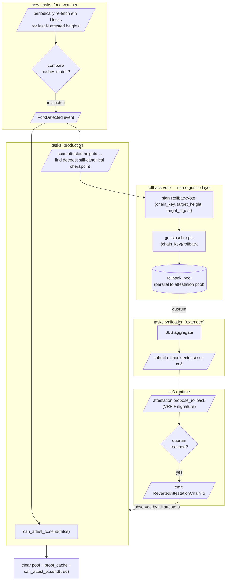

# Plan: attestor-driven fork detection + rollback consensus

> Status: **design draft**, awaiting review. No code yet.
> Owners: attestor team. Reviewers needed: runtime, security, ops.

## 1. Problem & scope

An attestor commits to an Eth source-chain block hash at height `H` via a finalized
attestation on cc3. If the Eth canonical chain later reorgs past `H` (deeper than what
we considered "mature"), the attestation chain now references blocks that aren't on
the source chain anymore. Today nothing reacts to this — attestors keep producing on
top of a poisoned chain.

We want each attestor to:

1. **Detect** that one of its past attestations no longer matches canonical Eth.
2. **Stop attesting** immediately to avoid digging deeper.
3. **Propose a rollback target** (a checkpoint height/digest that *does* still match
   canonical Eth).
4. **Vote with peers** on a rollback target via the same kind of BLS-aggregate
   consensus we already use for attestations.
5. **Trigger an on-chain reversion** once the rollback vote reaches quorum.
6. **Resume attesting** from the agreed checkpoint.

Visibility throughout: errors, structured metrics, distinctive log markers, optional
alerting hook.

## 2. What we already have to lean on

Before designing new mechanisms, the runtime + attestor already expose primitives we
can re-use:

- **`CcEvent::RevertedAttestationChainTo(chain_key, height, digest)`** — emitted on
  chain when an attestation chain reversion happens. Production handler in
  `tasks/production.rs` already reacts: clears pool, proof cache, resets
  `stream_attestation`. So *enacting* a rollback already works end-to-end; we just
  need to make attestors *propose* one.
- **Lightweight `Vote` + BLS aggregation pipeline** — gossip topic, pool, quorum
  detection, aggregation. We can reuse the same plumbing for rollback votes by
  piggy-backing on a new vote type.
- **Active attestor set + VRF eligibility** — same election mechanic that gates
  attestation submission can gate rollback-vote submission.
- **`shared.can_attest_tx: watch::Sender<bool>`** — already a one-line way to halt
  attestation production. Toggling this is sufficient for the "stop attesting" step.
- **BLS signing** — every attestor has a key and uses it to sign attestations; same
  key signs rollback votes.

The structure mirrors the attestation protocol almost exactly, just with a different
payload and a different on-chain dispatch. That's a deliberate design choice — fewer
new mechanisms = fewer ways things break.

## 3. High-level design



Three pieces of new functionality:

- **Attestor side**: new `fork_watcher` task; new vote type + gossip topic;
  rollback-aware extensions to validation/production.
- **Pallet side**: new extrinsic `attestation.propose_rollback`, new storage
  `PendingRollbacks`, vote-aggregation logic, enactment that triggers the existing
  `RevertedAttestationChainTo` event.
- **Observability**: log markers, metrics counters, runbook.

## 4. Detection — `tasks::fork_watcher`

A new task spawned alongside the existing four. It owns no chain mutation; it just
observes and emits a signal.

**State**: a bounded ring of `(height, expected_digest)` pairs for the last K
finalized attestations (K = 256 or so, sized to comfortably exceed the deepest
plausible Eth reorg). Populated from `CcEvent::BlockAttested` events as they arrive
— production already drives `latest_finalized_tx`; fork_watcher subscribes to that
watch and to a new ring-buffer of recent finalizations.

**Loop**:

1. Every `FORK_WATCH_INTERVAL` (start at 30 s, tunable), pull the oldest M heights
   from the ring (~16 at a time, oldest first).
2. For each, `eth.get_block(height)` and compute the same hash we previously attested
   to.
3. Compare against the stored `expected_digest`.
4. On mismatch:
   - Emit `ForkDetected { first_diverging_height, expected_digest, actual_digest }`
     via a new `mpsc::Sender<ForkDetected>` consumed by production.
   - Refuse to evict the entry from the ring until the rollback enacts (we may need
     to vote multiple times).

**Resilience**: never make a fork-detection decision from a single RPC reading.
Three sub-rules:

- **Confirmation depth**: only check heights below `tip - K_CONFIRM`
  (K_CONFIRM ~ 64 blocks ≈ 12 min on Sepolia). A reorg past 12-min finality is rare;
  under that depth, hash mismatches are normal racy reads.
- **Multi-read**: when a mismatch is observed, re-fetch 3× over ~30 s. Only emit if
  all 3 agree.
- **Multi-provider** (later phase): if `eth::Client` has fallback providers (it
  already supports this), cross-check the mismatched height against at least 2
  distinct providers. Single-provider rugpulls shouldn't flip a fork detection.

This is the *only* attestor-side fork-detection logic. Everything downstream (pause,
vote, etc.) keys off the `ForkDetected` signal.

## 5. Local safety response

Production task subscribes to the `ForkDetected` channel. On receipt:

1. **Pause attestation production**: `shared.can_attest_tx.send(false)`. The
   production loop's gate already honors this — the `stream_attestation.next()` arm
   becomes disabled. Validation also skips submissions when `can_attest == false`.
   No new attestations leave this attestor.
2. **Drop in-flight submission** (if any) — let it complete naturally but don't
   stash anything new.
3. **Determine rollback target**: walk backwards from `first_diverging_height`
   through the ring; for each, re-fetch the eth block and confirm match. The first
   height where the attested digest still matches the canonical chain is
   `target_height` / `target_digest`. (Practical defense: cap the lookback at, say,
   1024 heights — if we'd need to go deeper than that, refuse to propose; this is a
   "wake an operator" situation, not an autonomous-recovery one.)
4. **Loud log**:
   ```
   🚨 fork detected at height={first_diverging_height}
      expected_digest={...}
      actual_digest={...}
      proposed rollback target: height={target_height}, digest={target_digest}
      pausing attestation production
   ```
   At ERROR level. With structured fields so it shows up in metrics / alerting.
5. **Bump metrics**:
   - `attestor_fork_detected_total{chain_key}` (counter)
   - `attestor_attestation_paused{chain_key}` (gauge, 1/0)
   - `attestor_proposed_rollback_depth{chain_key}` (histogram, depth in heights
     below tip)
6. **Hand off** to the vote submitter (next section).

The attestor stays paused until it observes `RevertedAttestationChainTo` on cc3 —
production's existing handler then resets state and re-enables `can_attest`.

## 6. Rollback vote protocol

The pattern mirrors regular attestation: per-attestor
`RollbackVote { chain_key, target_height, target_digest, attestor, signature_bls }`
gossiped via libp2p, accumulated in a new pool, validated and submitted on chain by
the elected attestor.

**Why a separate pool, not the existing attestation pool?** Different semantics:
rollback votes don't have continuity proofs, don't follow attestation_interval, may
concurrently exist with attestation votes. Cleanest is to mirror the structure but
in a new `rollback_pool` crate (or a new module inside `attestor_pool`). The
plumbing — `Sender::send(vote)`, `Receiver::recv()` async API, `notify_one` wake,
threshold quorum — is identical to what we just simplified for attestations.

**Gossip topic**: `{chain_key}/rollback` — distinct from `{chain_key}/attest`, so we
don't pollute the attestation mesh with rollback chatter. Same libp2p Swarm
subscribes to both.

**Vote validation** (in the new pool):

- Sender must be in the active attestor set (same `ValidateAttestor` mechanic).
- Vote's `target_height` must be ≤ `last_finalized_height` (we don't roll forward).
- Vote's `target_digest` must match what the on-chain state has at that height
  (verified at submission time via runtime API call — cheap and avoids
  tinfoil-hat-attestors poisoning the rollback).
- Same-attestor / same-target_height twice with different `target_digest` =
  equivocation, same handling as attestation equivocation.

**Quorum threshold for rollback**: same `target_sample_size` mechanic as
attestations, OR explicitly set higher (e.g. 75% of the active attestor set).
Rollback is a more impactful action than a single attestation — defensible to
require a stricter threshold. **Open question — see § 11**: do we want a separate
`rollback_target_sample_size` on chain, or reuse the attestation one?

**Choosing the target when proposals differ**: different attestors may detect
different fork depths. The runtime should accept votes for any target, and only
enact if a *single* target reaches quorum. Implementation choice: bucket votes by
`(chain_key, target_height, target_digest)`; only the bucket that crosses threshold
gets enacted. If multiple buckets are close, the pool emits the deepest (most
conservative — lowest target_height) when it reaches quorum, breaking ties downward.

**Submission**: same VRF rank-backoff election as attestations. One elected attestor
submits the BLS-aggregated rollback proof.

## 7. New pallet extrinsic + storage

Pallet additions:

- **Storage**:
  ```rust
  PendingRollbacks: StorageMap<ChainKey, BTreeMap<(Height, Digest), BoundedVec<AttestorId, …>>>
  // or:  StorageMap<ChainKey, BoundedVec<(target, BLS_aggregate, signers), …>>
  ```
- **Extrinsic**:
  ```rust
  attestation::propose_rollback(
      chain_key: ChainKey,
      target_height: Height,
      target_digest: Digest,
      bls_aggregate: BlsSignature,
      attestors: Vec<AttestorId>,
  )
  ```
  Validation (in the dispatch):
  - All `attestors` are in the active set.
  - `attestors.len() >= rollback_threshold(chain_key)`.
  - BLS aggregate verifies against the rollback message canonicalized as
    `(chain_key, target_height, target_digest)`.
  - On-chain attestation at `target_height` has `digest == target_digest` (else the
    rollback target itself is bogus — reject).
  - `target_height < last_attested_height(chain_key)` (else nothing to revert).
- **Enactment**:
  - Walk `Attestations<T>` from current tip down to `target_height` and remove. Same
    as whatever the operator-triggered reversion path does today.
  - Emit `RevertedAttestationChainTo(chain_key, target_height, target_digest)` — the
    existing event the attestor already handles.
- **Failure-cost**: charge fees on submission (so an attestor that submits a bogus
  proposal pays for the runtime work). **Open question — see § 11**: do we want a
  slashing condition for an attestor that signs a rollback to a digest *not*
  present at the chosen height? Probably yes — that's a malicious vote.

**Origin**: any attestor in the active set. *Not* root/operators (so it's
automatic). The threshold-BLS aggregate is what makes it safe to be permissionless.

## 8. Resume after enactment

Production already handles `CcEvent::RevertedAttestationChainTo`:

```rust
CcEvent::RevertedAttestationChainTo(_chain_key, height, digest) => {
    let info = AttestationInfo { height, digest };
    *latest_cc3 = info;
    shared.pool_send.note_attestation_chain_reversion(height, digest);
    shared.proof_cache.clear();
    stream_attestation.note_attestation_chain_reversion(...).await;
    let _ = shared.latest_finalized_tx.send(Some(info));
}
```

One small extension: also re-enable attestation when this fires:

```rust
let _ = shared.can_attest_tx.send(true);  // resume after rollback
```

And clear the fork-watcher's local ring back to the rollback target.

The fork-watcher's ring should be reset on rollback so it doesn't immediately
re-detect the same fork from stale entries.

## 9. Observability — high-visibility design

Each step gets a distinctive log marker + ERROR/WARN level + structured fields
suitable for Prometheus scraping. Manager-readable summary:

```
🚨 fork detected                  (ERROR)   first attestor to notice
🛑 attestation production paused  (ERROR)   following fork detection
🗳️ rollback vote signed           (WARN)    sent to gossip
📩 rollback vote received         (INFO)    from peer (per vote)
🗳️ rollback quorum reached        (WARN)    pool yielded a (Quorum, target)
🛫 submitting rollback proposal   (WARN)    elected submitter
✅ rollback enacted on-chain      (WARN)    BlockAttested-style observation
🔄 attestor state reset           (INFO)    state cleared, production resumed
```

**Prometheus metrics** (added to the existing `metrics::Metrics`):

- `attestor_fork_detected_total{chain_key}` — counter
- `attestor_attestation_paused{chain_key}` — gauge (1 paused, 0 normal)
- `attestor_proposed_rollback_depth_blocks{chain_key}` — histogram
- `attestor_rollback_votes_received_total{chain_key, target_height}` — counter
- `attestor_rollback_quorum_seconds{chain_key}` — histogram (time from local detect
  to quorum reached, per event)
- `attestor_rollback_enactment_seconds{chain_key}` — histogram (detect → enactment)
- `attestor_rollback_total{chain_key, outcome=enacted|aborted}` — counter

**Alerting hooks** (the Prometheus side, not in code): page on-call when
`attestor_fork_detected_total` increments; warn when `attestation_paused == 1` for
>5 min without an enactment (means consensus didn't form — operator intervention
needed).

## 10. Rollout phases

Strictly additive — don't risk the steady state we just stabilized.

**Milestone 0 — design review**. Get sign-off on this doc. Specifically the open
questions in § 11 below before any code lands.

**Milestone 1 — detection-only ("dry run") attestor binary**.

- Add `tasks::fork_watcher` and the `ForkDetected` signal.
- On fork detection: log loudly + bump a metric + pause attestation.
- **Do not** propose a rollback yet.
- Operator reads the logs and triggers a manual rollback (existing operator
  extrinsic, if any).
- This validates the detection logic in production without giving attestors the
  power to vote on chain reversions yet.

Ship to usc-devnet first, soak for a week+. The detection logic is the riskiest part
to get right — false positives would be very bad (would spam-pause production
attestors).

**Milestone 2 — vote gossip + pool**.

- Add `RollbackVote` type, new gossip topic, new pool module.
- Attestors that detected a fork sign + gossip a rollback vote.
- Vote propagation observed in logs but **no on-chain submission yet**.
- Manual extrinsic still required to enact.
- Goal: confirm the peer-to-peer vote protocol works end-to-end without committing
  chain state changes.

**Milestone 3 — pallet + on-chain submission**.

- Add `attestation::propose_rollback` extrinsic + storage + enactment logic to the
  pallet.
- Wire up the validation task's submission path (rank-backoff, BLS aggregate,
  submit).
- usc-devnet deploy. Run synthetic fork drills (inject a faulty eth provider that
  lies about a block hash, observe full loop: detect → pause → vote → submit →
  enact → resume).

**Milestone 4 — production rollout**.

- usc-testnet for a week.
- usc-mainnet behind a runtime feature flag.
- Slashing decision (§ 11) made by this point.

Estimated effort: M1 ~1 week, M2 ~1 week, M3 ~2-3 weeks (pallet work + drills are
the big ones), M4 ongoing.

## 11. Open questions for design review

1. **Rollback threshold = attestation threshold?** Or stricter (e.g. 75%,
   supermajority)? Author's instinct: stricter. Rolling back is more consequential
   than appending; safer to require more attestor agreement.
2. **Multi-provider fork-confirm**: do we mandate fork detection requires N ≥ 2
   distinct eth providers agree before voting? Has cost and complexity but greatly
   reduces false-positive risk from a single rogue provider.
3. **Maximum rollback depth**: should we cap how far back a vote can target? A vote
   to roll back 10,000 blocks should arguably require operator override, not
   autonomous consensus. Suggest cap at, e.g., 1024 attestation intervals, beyond
   which we just stop attesting and page humans.
4. **Slashing**: should attestors who sign provably-bogus rollback proposals
   (target_digest doesn't match on-chain at that height) be slashed? Pros: aligns
   incentives. Cons: deployment risk during early rollout (a buggy attestor could
   get its key burned). Suggest M4-or-later concern.
5. **What if rollback consensus *itself* gets stuck?** I.e. all 9 attestors paused,
   no rollback vote reaches quorum because attestors disagree on the target. Need a
   timeout/escalation path. Probably an operator-only `force_rollback` extrinsic
   that exists as a break-glass, with the attestor protocol being the normal path.
6. **Submitter election for rollback votes**: reuse the attestation VRF, or
   different VRF seeded by the fork detection event? Reusing is cheaper code-wise;
   different gives stronger guarantees against grinding attacks but adds
   complexity.
7. **Genesis/cold-start interaction**: if an attestor starts cold after a recent
   fork, does it propose a rollback to its first-seen state, or trust the on-chain
   history? Must trust the chain state to avoid every cold start triggering a vote.

## 12. Out of scope (explicitly)

Listed here so reviewers don't conflate them with this work:

- **CC3-side reorgs**. This plan handles **source-chain** (Eth) forks reflected in
  attestation history. cc3's own consensus is unrelated; if cc3 itself reorgs
  that's a substrate-level concern.
- **Eth client improvements**. The fork-watcher uses whatever Eth providers
  `eth::Client` is already configured with. Multi-provider quorum (already
  supported by `Client`) is leveraged but not extended here.
- **Operator manual rollback**. Already exists or will exist via the operator
  extrinsic; this plan adds an *autonomous* path on top of that, not a replacement.
- **Cross-chain coordination**. Each `chain_key` runs its own fork detection /
  rollback independently. No global rollback.
- **Historical attestor punishment for the fork itself**. Attestors who attested to
  the now-forked chain didn't do anything wrong (they followed the eth chain that
  the network presented at the time). This plan handles the recovery, not
  retroactive blame.

## Deliverables checklist (for the eventual PR set)

- [ ] `attestor/attestor/src/tasks/fork_watcher.rs` — new task
- [ ] `attestor/attestor/src/shared.rs` — new channels: `fork_detected_tx/rx`,
      `proposed_rollback_tx/rx` watch
- [ ] `attestor/attestor/src/tasks/production.rs` — handle `ForkDetected` +
      already-handles `RevertedAttestationChainTo`; new pause/resume on
      `can_attest`
- [ ] `attestor/attestor/src/tasks/p2p/mod.rs` — second gossip topic + new vote
      type encode/decode
- [ ] `attestor/attestor/src/tasks/validation.rs` — submit `propose_rollback`
      extrinsic when rollback pool yields a quorum
- [ ] `attestor/pool/src/lib.rs` (or new `rollback_pool/` crate) — vote
      aggregation for rollback votes
- [ ] `pallets/attestation/src/lib.rs` — `propose_rollback` extrinsic,
      `PendingRollbacks` storage, enactment + event
- [ ] `attestor/metrics/src/lib.rs` — new histograms + counters
- [ ] Runbook entry: "attestor fork detected — what to do" — for on-call
- [ ] Synthetic fork-injection test under `attestor/zombienet/` — drives a forked
      eth scenario, asserts full loop completes
