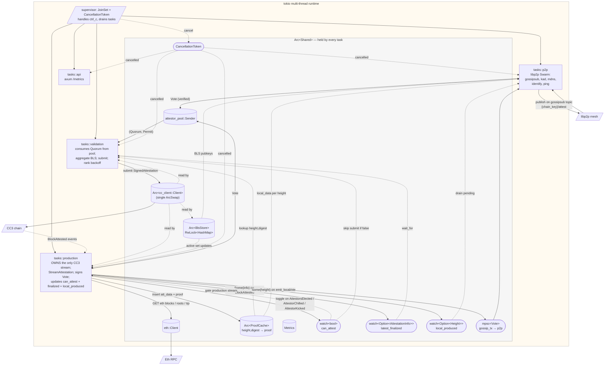

# attestor — design notes

This document captures the current shape of the attestor: how the async tasks are wired,
what the data ownership story is, what's open, and what's known fragile. It is the
post-rework snapshot — the previous (multi-thread, value-cloned-`Client`) implementation has
been removed; the design described below is what's running.

Last revised after the 2026-05-14 rename. The companion `attestor_pool` crate sits next to
this one and is referenced throughout.

---

## 1. What the attestor does

Observe Eth finality → produce attestations for source-chain blocks at fixed intervals →
gossip lightweight votes to peers via libp2p → once enough peers agree on the same digest,
aggregate their BLS signatures → submit on-chain through CC3. Plus react to chain events
(attestor set rotations, interval changes, chain reversions) and stay alive across CC3/Eth
RPC reconnects.

Lightweight-vote protocol: peers gossip `(chain_key, height, digest, attestor_id,
signature_bls)` — **not** the full continuity proof. Only the elected submitter builds and
submits the proof. ~200 B/vote vs. a few KB in the old protocol; ~10× bandwidth reduction at
typical quorum sizes.

---

## 2. Runtime topology



Key shape properties:

- **One** tokio multi-thread runtime. No `std::thread::spawn`. No per-worker runtimes.
- **One** `Arc<cc_client::Client>` shared by every task. The crate's internal `ArcSwap`
  means any task's `reconnect()` is observed by every other task on its next call.
- **One** CC3 finality event subscription, owned by production. Validation watches
  `shared.latest_finalized_rx: watch::Receiver<Option<AttestationInfo>>` to know when a
  height has finalized — no second subscription.
- Cancellation is a single `tokio_util::sync::CancellationToken`. Ctrl-C lives only in the
  supervisor's main `select!`. Tasks return ordinary `Result<(), Error>`.

---

## 3. The four async tasks

All four run as `tokio::spawn` on the main runtime. They share `Arc<Shared>` for state.

### `tasks::api` — Prometheus exporter

Owns an `axum` listener on the configured API port (default 9100). `/metrics` encodes the
shared `Metrics` registry.

```rust
loop {
    select {
        _ = shared.token.cancelled() => return Ok(()),
        res = axum::serve(listener, router) => { res?; return Ok(()); }
    }
}
```

### `tasks::p2p` — libp2p Swarm

Owns the `Swarm` (TCP+QUIC transports, gossipsub+kad+mdns+identify+ping behaviours).
Subscribes to `{chain_key}/attest`.

```rust
loop {
    select {
        biased;
        _ = shared.token.cancelled() => return Ok(()),
        Some(vote) = gossip_rx.recv(), if can_broadcast => publish(vote),
        res = local_produced_rx.changed() => drain_pending_for_height(),
        event = swarm.select_next_some() => handle_swarm(event),
    }
}
```

Incoming votes are decoded, verified against the local `AttestationData` (looked up from
`proof_cache.local_data(height)`), and inserted into the pool. If we haven't produced
locally at that height yet, the vote is queued in a bounded `HashMap<Height, Vec<Vote>>`
(32 per height max) and drained when production signals via `local_produced_rx`.

### `tasks::production` — the chain-state machine

The most stateful task. Sole owner of:
- the CC3 finality event subscription (one, not three),
- the eth `StreamAttestation`,
- writes to `shared.can_attest_tx`, `shared.latest_finalized_tx`, `shared.local_produced_tx`,
  `shared.proof_cache`, and the `pool.note_*` chain-event hooks.

Startup sequence:
1. Build the eth `StreamRoots` / `StreamTip` / `StreamAttestation`.
2. Open the CC3 event stream.
3. If `start_attestation == None`:
   - Generate the genesis attestation.
   - Emit it (push to pool + gossip).
   - **Actively wait for `BlockAttested(>= genesis_height)` on the CC3 stream** to learn the
     real on-chain digest. (See § 5 for why — this was the bug that produced the
     `InvalidContinuityProofTail` failures before the fix.)
   - Notify `stream_attestation` of the real prev-digest; update `latest_finalized_tx`.
4. Enter the main loop:

```rust
loop {
    let can_attest = *shared.can_attest_rx.borrow();
    select {
        biased;
        _ = shared.token.cancelled() => return Ok(()),
        Some(batch) = events.next() => handle_cc3_batch(batch).await,
        Some(att) = stream_attestation.next(), if can_attest => emit_local(att).await,
    }
}
```

`emit_local`:
1. caches `(attestation_data, continuity_proof)` in `shared.proof_cache`,
2. signs a lightweight `Vote { chain_key, height, digest, attestor, sig_bls }`,
3. pushes into the local pool **and** into `gossip_tx`,
4. signals `local_produced_tx.send(Some(height))` so p2p can drain its pending buffer.

### `tasks::validation` — submitter

Drains quorums from the pool and ships them to the runtime.

```rust
loop {
    let submission_fut = futures::future::OptionFuture::from(in_flight.as_mut());
    select {
        biased;
        _ = shared.token.cancelled() => return Ok(()),
        Some(joined) = submission_fut => handle_submission_result(joined?).await,
        Some((quorum, permit)) = pool_rx.next() => handle_quorum(quorum, permit).await,
    }
}
```

On a new quorum: aggregate BLS, look up the local proof from `shared.proof_cache`, run the
head/tail/continuity checks **only on the local proof** (peers do no proof work). Then
`tokio::spawn` a submission task. If a submission is already in-flight, stash the new quorum
for later via the pool's `mark_for_later` path. Duplicate-height quorums (same height as the
in-flight submission) are discarded.

The submission task does VRF rank-backoff, watches `shared.latest_finalized_rx` to bail out
early if some other attestor wins the race, then calls
`cc3.api().tx().sign_and_submit_then_watch_default(...)`.

On `MajorityNotReached`: re-inject votes into the pool after `note_majority_not_reached`
clears the local-validation lock for that height. The pool will re-quorum under whatever
target sample size is now active.

---

## 4. Reconnect and resilience

- **Shared `Arc<cc_client::Client>`** is the structural fix for the original
  reconnect-data-duplication bug. The crate's internal `ArcSwap` is shared by every task;
  any task's `cc3.reconnect()` rolls forward for everyone on the next call.
- **`retry::with_retries(cc3, token, |cc3| async { ... })`** wraps individual runtime-API
  calls. Exponential backoff (100ms → 3.2s cap). Classifies transient errors (JSON-RPC
  disconnects, IO errors, jsonrpsee transport errors) and fires `cc3.reconnect()` between
  attempts. Used at `bls::fetch` and the three runtime-API calls in
  `validation::aggregate_and_validate`.
- **What this does not cover today**: `eth::Client` still has a value-cloned `#[derive(Clone)]`
  shape. The attestor doesn't trip it (we only use `shared.eth` at startup; long-lived
  streams self-heal via their own retry loops), but if anyone adds a second long-lived eth
  consumer it will resurface. Recommended follow-up: mirror cc3's `ArcSwap<Provider>`
  pattern inside the `eth` crate.

---

## 5. The genesis bug we found while running this

First multi-attestor run hit `InvalidAttestationContinuityProofTail` rejections at every
height after genesis. Root cause:

1. `lib.rs` initialized `latest_finalized_rx` with `(genesis_height, ZERO_DIGEST)` as a
   placeholder when `start_attestation == None`.
2. `wait_finalized(genesis)` in production's genesis branch checked
   `rx.borrow().height >= genesis` — which is `genesis >= genesis = true`, so it returned
   **immediately** without ever waiting for the actual on-chain BlockAttested event.
3. The code then read back `ZERO_DIGEST` and called
   `stream_attestation.note_attestation_finalization(ZeroDigest)`.
4. Every subsequent eth-stream attestation's continuity proof had `tail_prev_digest = ZERO`,
   while the runtime saw the real genesis digest as `last_digest`.
5. Submission → tail digest doesn't match → `InvalidAttestationContinuityProofTail`.

Current state: `latest_finalized_*` is `watch<Option<AttestationInfo>>` (initial `None`
rather than placeholder zeros), and the genesis branch in production drains the CC3 event
stream inline until it observes the real `BlockAttested(genesis)`, *then* tells
`stream_attestation` and the watch.

Lesson worth keeping: **a sentinel value that happens to satisfy your invariant
("height ≥ X") is worse than no value at all**. Use `Option<T>` for "not yet known".

---

## 6. Open regression — `🔗 connection up` not firing

A zombienet smoke run on 2026-05-14 12:54 hangs in "waiting for genesis BlockAttested"
indefinitely. The 11:05 run that day (earlier binary, before the pending-votes buffer was
added) was green end-to-end.

What we know:

- All 3 attestors discover each other via mDNS (`🛰️ local mdns peer` logs fire ×2 on each).
- Each then logs ~6× `⛔ outgoing connection error: Address already in use (os error 48)`
  within the same second. This pattern also occurred in the 11:05 run, where it was
  immediately followed by a successful `🔗 connection up` event.
- In the 12:54 run, `🔗 connection up` **never** fires — yet `lsof -nP -i :9000 -i :9001 -i
  :9002` confirms that all three attestor processes have **ESTABLISHED** TCP connections to
  each other at the OS level.
- Consequence: gossipsub never gets a working mesh from libp2p's point of view →
  `can_broadcast` stays `false` → outgoing votes pile in the `mpsc::Receiver<Vote>` channel
  → peers don't receive our votes → no quorum forms → no submission → no `BlockAttested`
  event → production task's genesis-wait loop never exits.

Most likely cause (not yet confirmed):

- The pending-votes buffer added a new arm to p2p's `select!`
  (`res = local_produced_rx.changed() => …`). The `biased` ordering puts it before the
  `swarm.select_next_some()` arm. If `local_produced_rx.changed()` becomes spuriously ready
  in a way that prevents the swarm from being polled (or polls it less frequently), swarm
  events including `ConnectionEstablished` may be dropped/delayed in a way that the swarm
  internally reconciles as "still connecting" while the TCP layer is already established.
- Alternative: a subtle libp2p `SwarmEvent` shape change between codepaths that the new
  `handle_swarm` argument-shape doesn't match against any longer.

What to try next:

1. **Bisect.** Revert the p2p `select!` arm and the `local_produced_*` watch wiring. Verify
   the 11:05-style green run returns. Then re-apply the buffer in a way that doesn't change
   the order/structure of the existing select arms — e.g., signal via a tokio `Notify`
   polled inside the existing swarm arm, or move the drain into the gossipsub-`Subscribed`
   handler.
2. **Instrument.** Add a catch-all `event => tracing::trace!(?event, "swarm event")` ahead
   of the existing match in `handle_swarm`. Run with `RUST_LOG=attestor=trace`. If
   `ConnectionEstablished` isn't in the trace stream, libp2p isn't surfacing it, which
   points to a swarm-construction issue rather than `select!` starvation.
3. **Check libp2p 0.56 changelog.** Confirm `SwarmEvent::ConnectionEstablished` is still
   the same struct shape we're matching on.

Pragmatic workaround in the meantime: temporarily back out the `local_produced_rx.changed()`
arm in `tasks/p2p/mod.rs` (and the corresponding `local_produced_tx.send(Some(height))` in
production's `emit_local`). The pending-votes buffer degrades to "drop and rely on
gossipsub heartbeat" — that was the behavior of the 11:05 green run.

---

## 7. What's still left

### Outstanding

1. **§ 6 p2p regression.** Highest priority. Smoke-test is not currently green end-to-end
   until this is resolved.
2. **`eth::Client` audit follow-up.** Mirror cc3's `ArcSwap<Provider>` pattern in the `eth`
   crate so reconnect-across-clones works for eth too.
3. **Tests beyond pool.** `attestor_pool` has 5 unit tests. `validation` and `proof_cache`
   still have no coverage.
4. **CC3 stream's own retry loop** lives unchanged in `common/streams/cc3`. With only one
   subscription now, any bug there is a single point of failure for the entire attestor's
   chain-state machine.

### Validation status

- **Smoke run without chain blip.** ✅ Confirmed green on the 2026-05-14 11:05 build
  (3 attestors, mDNS-discovered, gossip → quorum → submit → cc3 finalize, repeating
  cleanly). Per-attestor counts: 2/3/2 submissions, 4/3/5 finalizations seen externally,
  0 rejections, 0 timeouts. The 12:54 build hit § 6 and stalls in genesis-wait.
- **Real cc3 network blip test.** Not yet run.
- **Eth blip test.** Not yet run.
- **Production-shape soak (24h+ against real Sepolia/mainnet).** Not yet run.
- **Submission race fairness.** Initial 2/3/2 in the 11:05 sample looks healthy but too
  short to be conclusive.

### Sins knowingly committed

- `retry::is_transient` classifies jsonrpsee transport errors by **string match** on the
  `Box<dyn Error>::to_string()`. jsonrpsee doesn't expose a stable enum from subxt's
  surface. If the strings change with a dep bump, classification silently degrades.
- `attestation.rs` still carries a `checkpoint_interval` field that is never used; copied
  verbatim from the prior implementation.
- `attestor_pool`'s `dev-dependencies` enables
  `tokio = { features = ["signal", "macros", "rt"] }` so `cargo test -p attestor_pool` can
  compile standalone. Works around a pre-existing cc-client quirk (cc-client calls
  `tokio::signal::ctrl_c` without declaring the feature on its own `tokio` dep).

---

## 8. Quick reference

### Crate layout

```
attestor/
├── attestor/          # binary + lib
│   ├── Cargo.toml
│   └── src/
│       ├── main.rs           # CLI / config parsing
│       ├── lib.rs            # supervisor: JoinSet + CancellationToken
│       ├── error.rs
│       ├── secret.rs
│       ├── attestation.rs
│       ├── bls.rs            # parking_lot::RwLock, takes &Arc<Client>
│       ├── shared.rs         # Arc<Shared>: cc3, eth, bls_store, watches, channels, token
│       ├── startup.rs        # wait_for_endpoints, register_bls, wait_for_eligible
│       ├── proof_cache.rs    # (height, digest) → (AttestationData, ContinuityProof)
│       ├── vote.rs           # Vote signing + verification
│       ├── retry.rs          # with_retries(cc3, token, …) shim
│       └── tasks/
│           ├── mod.rs
│           ├── api.rs
│           ├── p2p/
│           │   ├── mod.rs        # task entrypoint
│           │   ├── behavior.rs
│           │   └── protocols.rs
│           ├── production.rs
│           └── validation.rs
├── pool/              # lightweight-vote pool
│   ├── Cargo.toml
│   └── src/
│       ├── lib.rs
│       └── error.rs
├── common/
├── metrics/
└── zombienet/
```

### Build / run

```sh
# build
cargo build -p attestor --release

# run with zombienet (single-host smoke test)
cargo run -p attestor_zombienet --release -- \
  --bin ./target/release/attestor \
  --config ./attestor/config.yaml \
  --number 3 \
  --chain-key 2 \
  --eth-url ws://localhost:8545 \
  --cc3-url ws://localhost:9944 \
  --funding-address "//Alice"

# unit tests
cargo test -p attestor_pool
```

### Healthy-run log markers (in order)

```
🙋‍♀️ starting attestor             # main()
🔍 balance ok                       # startup balance check
📝 Submitting attest()             # register BLS (Idle → Waiting)
✅ attest() submitted
⏲️ waiting on election...         # poll AttestorsElected
☀️ elected
🧑‍🤝‍🧑 chain data                  # interval / quorum / start point fetched
📮 starting attestation pool
✅ all services online
📌 api server up
🔭 Starting new p2p node
🛰️ local mdns peer                # peer discovery (mDNS-only on zombienet)
📋 new routing peer
🔗 connection up                   # see § 6 if this never fires

👶 generating genesis attestation  # first attestor to bootstrap (one of the swarm)
⏲️ waiting for genesis attestation to finalize
✅ genesis attestation finalized on-chain

📡 produced local attestation      # eth StreamAttestation emit
✉️ gossiped vote                    # outgoing on gossipsub
🗳️ quorum reached                  # pool emitted (Quorum, Permit) to validation
🏁 rank backoff                    # VRF rank delay before submitting
✅ submitted on-chain              # our submission landed
💾 cc3 finalized                   # BlockAttested observed
✅ finalized externally            # peer submitted, we observed via cc3
🛟 checkpoint                      # cc3 CheckpointReached event
⏰ new attestor set / 🎲 new epoch  # CC3 epoch rotation handling
```
