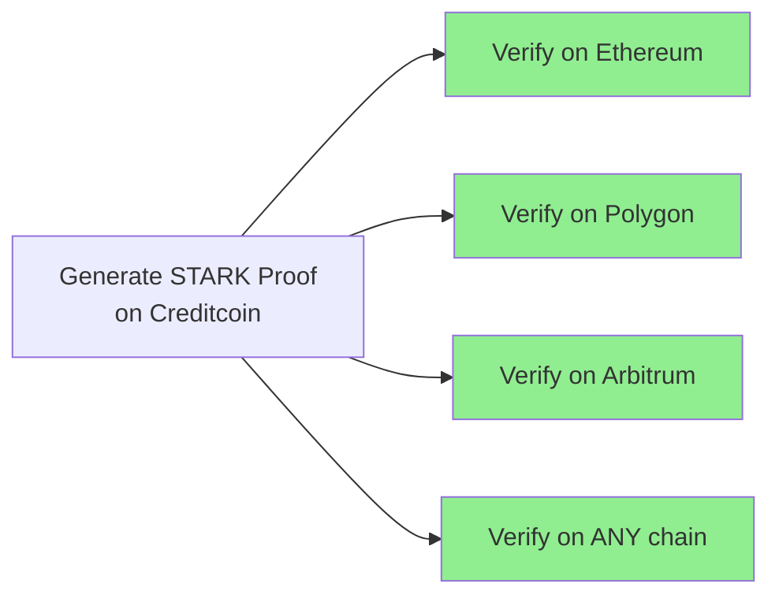
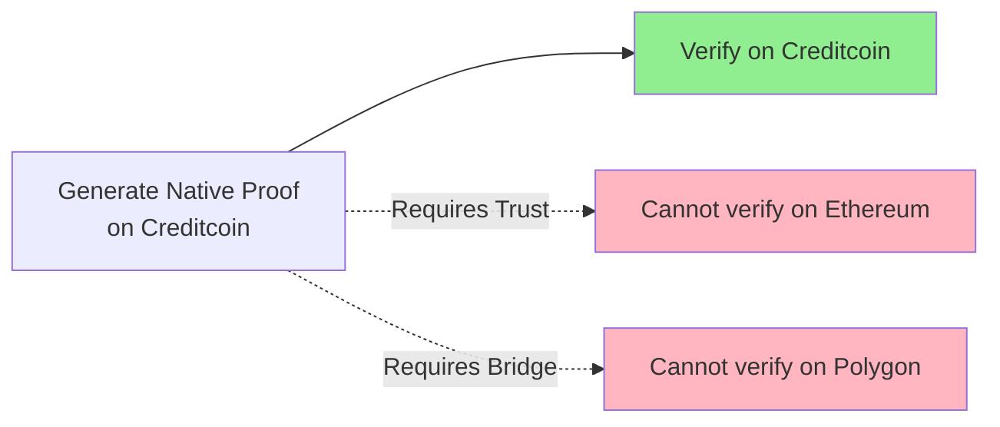

# STARK vs Native Precompile: Cost-Benefit Analysis

**Last Updated:** With real-world performance data (15-minute STARK proof generation)

## Executive Summary

**Critical Finding:** STARK proof generation takes **15 minutes** on high-end CPUs.

**The Fundamental Trade-off:**
- **STARK**: Universal trustless verification across any chain, but 15-minute generation time
- **Native Precompiles**: 9,000x faster (<100ms), but only works within Creditcoin's trust model

**Recommendation depends on strategic vision:**
- **Building a universal proof layer?** → Keep STARK despite the cost
- **Building a fast oracle chain?** → Switch to native precompiles
- **Need both?** → Implement hybrid approach

---

## Table of Contents
1. [Real-World Performance Data](#real-world-performance-data)
2. [The Trust Model Difference](#the-trust-model-difference)
3. [Cost Comparison (Updated)](#cost-comparison-updated)
4. [Cross-Chain Implications](#cross-chain-implications)
5. [Strategic Recommendations](#strategic-recommendations)
6. [Hybrid Approach](#hybrid-approach)

---

## Real-World Performance Data

### STARK Approach (Actual Performance)

#### Proof Generation
- **Time**: **15 minutes** (900 seconds) on high-end CPU
- **CPU**: 32+ cores at 100% utilization
- **Memory**: 2-4GB RAM
- **Infrastructure**: Dedicated prover service required
- **Cost per proof**: $0.50-1.00 (cloud compute)
- **Monthly infrastructure**: $10,000+ for reasonable throughput

#### User Experience Impact
```
User submits query → Wait 15 minutes → Get proof → Submit to chain → Wait for block
Total time: 15-20 minutes
```

### Native Precompile Approach (Estimated)

#### Proof Generation
- **Time**: <100ms (0.1 seconds)
- **CPU**: Single core, minimal usage
- **Memory**: <100MB
- **Infrastructure**: Basic API server
- **Cost per proof**: <$0.001
- **Monthly infrastructure**: $100-500

#### User Experience Impact
```
User submits query → Generate proof (<100ms) → Submit to chain → Wait for block
Total time: 15-30 seconds
```

### Performance Comparison

| Metric | STARK (Actual) | Native Precompile | Improvement Factor |
|--------|---------------|-------------------|-------------------|
| **Proof Generation** | 15 minutes | <100ms | **9,000x faster** |
| **CPU Cost** | $0.50-1.00 | <$0.001 | **500-1000x cheaper** |
| **User Wait Time** | 15-20 min | 15-30 sec | **60x better** |
| **Infrastructure/month** | $10,000+ | $100-500 | **20-100x cheaper** |
| **Proof Size** | 200-500KB | 20-50KB | **10x smaller** |
| **Gas Cost** | 2-5M | 1.5-2.5M | **20-40% cheaper** |

---

## The Trust Model Difference

### STARK Proofs - Universal Trustless Verification

**Key Property:** Anyone can verify the proof without trusting anyone.



**Trust Requirements:**
- ✅ Mathematics only
- ✅ No need to trust Creditcoin validators
- ✅ No need to trust any intermediaries
- ✅ Cryptographically secure

**Use Cases:**
- Cross-chain DeFi protocols
- Trustless bridges
- External verification by any party
- Regulatory compliance requiring proof

### Native Precompiles - Chain-Specific Trust

**Key Property:** Verification requires trusting Creditcoin's validator set.



**Trust Requirements:**
- ❌ Must trust Creditcoin validators
- ❌ Other chains cannot independently verify
- ❌ Requires bridges/oracles for cross-chain

**Use Cases:**
- Creditcoin-internal operations
- Applications already trusting Creditcoin
- Time-sensitive queries
- High-volume, low-stakes proofs

---

## Cost Comparison (Updated)

### Total Cost of Ownership (Monthly)

#### STARK System
```
Infrastructure:
- Prover servers (10x high-end): $10,000/month
- Storage for proofs: $500/month
- Bandwidth (500KB per proof): $1,000/month

Operational:
- Per-proof compute: $0.50-1.00
- 10,000 proofs/month: $5,000-10,000
- DevOps maintenance: $5,000/month

Total: $21,500-26,500/month
```

#### Native Precompile System
```
Infrastructure:
- API servers (2x for redundancy): $200/month
- Storage: $50/month
- Bandwidth (50KB per proof): $100/month

Operational:
- Per-proof compute: <$0.001
- 10,000 proofs/month: <$10
- DevOps maintenance: $1,000/month

Total: $1,360/month
```

**Savings: $20,000+/month (93-95% reduction)**

---

## Cross-Chain Implications

### Scenario Analysis

#### Scenario 1: Universal Proof Layer

**Vision:** "Creditcoin provides trustless proofs to all blockchains"

```solidity
// On Ethereum
contract DeFiProtocol {
    function verifyExternalData(bytes calldata starkProof) {
        // Can verify Creditcoin's proof without trusting Creditcoin
        require(STARKVerifier.verify(starkProof), "Invalid proof");
        // Use the verified data...
    }
}
```

**Requirements:**
- ✅ STARK is MANDATORY
- ✅ Universal verifiability is core value prop
- ⚠️ Must accept 15-minute generation time
- 💡 Consider optimization strategies

#### Scenario 2: Fast Oracle Chain

**Vision:** "Creditcoin provides fast, cheap data within its ecosystem"

```solidity
// On Creditcoin
contract CreditcoinDApp {
    function verifyData(bytes calldata nativeProof) {
        // Uses Creditcoin's native precompiles
        require(Precompiles.verifyMerkle(nativeProof), "Invalid proof");
        // Fast and cheap within Creditcoin
    }
}
```

**Requirements:**
- ✅ Native precompiles optimal
- ✅ 9,000x faster proofs
- ⚠️ Limited to Creditcoin ecosystem
- ❌ No cross-chain capability

#### Scenario 3: Hybrid Approach

**Vision:** "Fast by default, universal when needed"

```solidity
contract HybridVerifier {
    function submitFastProof(Query q, NativeProof p) {
        // For Creditcoin-internal use (99% of queries)
        // <100ms generation, immediate response
    }

    function submitUniversalProof(Query q, STARKProof p) {
        // For cross-chain use (1% of queries)
        // 15-minute generation, universal verification
    }
}
```

---

## Strategic Recommendations

### Option 1: Optimize STARK (If Cross-Chain is Critical)

Instead of abandoning STARK, make it faster:

| Optimization | Potential Speedup | New Time | Cost |
|-------------|------------------|----------|------|
| **Cairo 1 Upgrade** | 5-10x | 1.5-3 min | $50K development |
| **GPU Acceleration** | 10-50x | 20-90 sec | $100K + GPU costs |
| **Proof Aggregation** | Amortized | <1 min/query | $30K development |
| **Distributed Proving** | 3-5x | 3-5 min | $20K + infrastructure |
| **Caching Common Proofs** | Instant for repeats | 0 sec | $10K development |

**Combined potential:** 15 minutes → 30-90 seconds

### Option 2: Implement Native Precompiles (If Speed is Critical)

**Development Plan:**
1. **Week 1-2:** Build precompiles
   - Pedersen Merkle verification
   - Continuity chain verification
2. **Week 3:** Testing & benchmarking
3. **Week 4:** Integration & deployment

**Benefits:**
- ✅ 9,000x faster (15 min → 100ms)
- ✅ 95% lower operational costs
- ✅ Better user experience
- ❌ Loses cross-chain capability

### Option 3: Hybrid System (Best of Both Worlds)

**Architecture:**
```
┌─────────────────────────────────────┐
│         Query Request               │
└────────────┬───────────────────────┘
             │
    ┌────────▼────────┐
    │  Need cross-chain│
    │   verification?  │
    └────┬──────┬─────┘
         │      │
     No  │      │ Yes
         │      │
    ┌────▼───┐  └──────┐
    │ Native │         │
    │ <100ms │    ┌────▼─────┐
    └────────┘    │  STARK   │
                  │ 15 min   │
                  └──────────┘
```

**Implementation:**
- Default to native (99% of queries)
- STARK on-demand for cross-chain
- User pays premium for universal proofs
- Batch multiple queries into single STARK

---

## Decision Matrix

### Key Questions

| Question | If Yes → | If No → |
|----------|----------|---------|
| Need trustless cross-chain verification? | Keep STARK | Native precompiles |
| Is 15-minute wait ever acceptable? | Consider STARK | Native only |
| >10% of queries need external verification? | Hybrid or STARK | Native only |
| Can afford $20K+/month infrastructure? | Either option | Native only |
| Is Creditcoin becoming "proof infrastructure"? | STARK mandatory | Native better |
| Need immediate query responses? | Native mandatory | Consider STARK |

### Recommendation by Use Case

| Primary Use Case | Recommendation | Reasoning |
|-----------------|----------------|-----------|
| **Cross-chain DeFi** | STARK + Optimize | Trust minimization critical |
| **Creditcoin dApps** | Native Precompiles | Speed and cost matter most |
| **Mixed Usage** | Hybrid Approach | Flexibility for different needs |
| **Enterprise Oracle** | Native + SLA | Speed critical, trust via contracts |
| **Regulatory Compliance** | STARK | Mathematical proofs required |

---

## Risk Analysis

### STARK-Only Risks
- ⚠️ **User Abandonment**: 15-minute wait unacceptable for most users
- ⚠️ **Cost Overrun**: $20K+/month may not be sustainable
- ⚠️ **Competitive Disadvantage**: Others offer instant proofs

### Native-Only Risks
- ⚠️ **Limited Market**: Cannot serve cross-chain use cases
- ⚠️ **Trust Assumptions**: Requires faith in Creditcoin validators
- ⚠️ **No Differentiation**: Becomes "just another oracle"

### Mitigation Strategies
1. **Start with Hybrid**: Hedge bets, learn from usage patterns
2. **Optimize STARK**: Invest in speed improvements
3. **Market Research**: Survey users on trust vs speed preferences
4. **Gradual Migration**: Phase approach based on data

---

## Conclusion

### The Core Trade-off

```
STARK: Universal Trust ←→ Native: Speed & Cost
        (15 minutes)         (<100ms)
```

### Final Recommendation

**If Creditcoin's vision is:**

1. **"The Internet's Proof Layer"** → Keep STARK, invest heavily in optimization
2. **"Fast Oracle for Creditcoin"** → Switch to native precompiles immediately
3. **"Flexible Proof Infrastructure"** → Implement hybrid approach
4. **Uncertain** → Start with hybrid, let market decide

### The Numbers Don't Lie

- Native is **9,000x faster**
- Native is **95% cheaper** to operate
- But STARK is **infinitely more trustless**

**The choice depends on what you're building: A universal proof layer needs STARK despite the cost. A fast oracle chain needs native precompiles. Only you can decide which vision Creditcoin should pursue.**

---

## Appendix: Implementation Details

### Native Precompile Specifications

```rust
// Precompile 1: Merkle Verification
fn verify_merkle_proof(
    root: Felt,
    leaf: Felt,
    index: u64,
    siblings: Vec<Felt>
) -> bool {
    // ~3K gas per level
    // Total: 60-90K gas for depth 20-30
}

// Precompile 2: Continuity Chain
fn verify_continuity(
    query_block: BlockInfo,
    continuity_blocks: Vec<ContinuityBlock>,
    checkpoint: Felt,
    attestations: Vec<Attestation>
) -> bool {
    // ~3K gas per block + 500K for signatures
    // Total: 800K-1.5M gas
}
```

### STARK Optimization Roadmap

1. **Q1 2024**: Cairo 1 upgrade (5-10x speedup)
2. **Q2 2024**: GPU acceleration (additional 10x)
3. **Q3 2024**: Proof aggregation (amortize costs)
4. **Q4 2024**: Target: <1 minute proof generation

### Hybrid System Architecture

```yaml
services:
  query-router:
    determines: proof_type_needed

  native-prover:
    handles: internal_queries
    performance: <100ms
    cost: <$0.001

  stark-prover:
    handles: cross_chain_queries
    performance: 15min (optimizing to <1min)
    cost: $0.50-1.00

  proof-cache:
    stores: common_proofs
    hit_rate: target >30%
```
