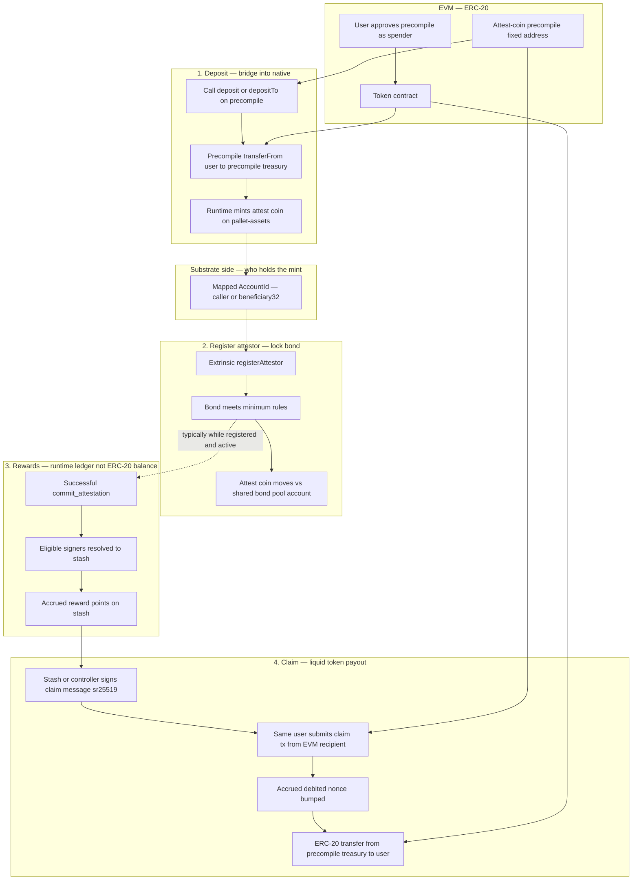

# Attest-coin rewards — overview (Confluence)

**Audience:** product, operations, and partners who need the “what and why” without implementation detail.
**Companion:** engineers should use the repository technical specification for exact interfaces and behavior.

---

## Summary

**Attest-coin rewards** tie **Creditcoin attestation activity** to a **liquid ERC-20 token on the EVM**. Separately, the chain also supports a **native Substrate asset** (a **fungible asset** tracked by the runtime’s asset system—see **FRAME `pallet-assets`**) used for **bonding** when you bridge ERC-20 in via **deposit**. **Reward points** (for claims) are **not** that Substrate asset balance: the chain records **reward points per economic actor (stash)** in a dedicated ledger. When that actor is ready to receive **liquid** tokens, they **claim** through a fixed **EVM entry point (precompile)**. The claim **moves ERC-20 from a treasury balance** held under that entry point—it does **not** mint new ERC-20 supply as part of the claim.

---

## Why two layers?

| Concept | Plain language |
|--------|----------------|
| **Reward points (on-chain ledger)** | A running balance of “what you’ve earned” from attestation, keyed to your **stash** (the account that holds the bond and economic stake). This is **not** the ERC-20 balance by itself. |
| **The token (EVM)** | The **tradeable** asset lives in a normal **ERC-20 contract**. Users see balances in wallets and DEX tooling like any other token. |
| **Native Substrate asset (attest coin on `pallet-assets`)** | When you **deposit** ERC-20 through the precompile, the runtime **mints** a matching balance as a **Substrate fungible asset** (configured **asset ID** on chain). That native balance is what **attestation bonding** uses (minimum bond, bond pool)—**not** the reward-points ledger and **not** the same thing as your ERC-20 wallet balance. |
| **The link (claim)** | A successful **claim** subtracts from your **reward points** and triggers an **ERC-20 transfer** from a **treasury** to your **EVM address**. |

This split lets the protocol **account for work** in the attestation layer while still using **standard EVM tokens** for liquidity.

---

## Bridging into native attest coin (bonding)

Separately from **claims**, users can **deposit** the same ERC-20 into a fixed **precompile** so the runtime **mints** a matching balance as a **Substrate fungible asset** managed by **`pallet-assets`** (often referred to as the **native attest-coin asset**; it has a fixed **asset ID** on the network). That **Substrate asset balance** is what **attestation bonding** uses when a stash **registers an attestor** (minimum bond rules, shared bond pool, etc.). You **approve** the precompile as spender on the ERC-20, then call **`deposit`** or **`depositTo`** on the precompile; details and chain-genesis requirements (including funding the **bond pool** account) are in the technical specification.

### Diagram — deposit, register attestor, bond (and how it relates to rewards and claims)

The diagram below is **one page** view: **left column** is how you get **native attest coin** and **post bond**; **right column** is the **separate reward ledger** and how you **receive liquid ERC-20** later. **Deposit** and **claim** both touch the same precompile address on the EVM, but they do **different** things (mint native vs. transfer ERC-20 out of treasury).

**How to read it**

- **Steps 1–2** are the **bonding preparation** path: ERC-20 in the wallet → **native attest coin** on the chain → **register attestor** locks bond according to attestation rules and the **bond pool** (genesis must fund that pool account; see technical spec).
- **Step 3** is **independent**: reward **points** accrue to the **stash** when your role counts on a committed attestation; this is **not** your ERC-20 wallet balance until you **claim**.
- **Step 4** converts **points** into **ERC-20** via a signed authorization; the token **leaves** the precompile’s ERC-20 balance (treasury). **No new ERC-20 supply** is minted on claim.

---

## How rewards build up

1. **Attestation success** — When an attestation is committed and your role counts as an **eligible signer**, the network can **credit reward points to your stash** (via the configured per-signer rule). Multiple attestor identities can map to the **same stash**; points accrue to that **one** stash.
2. **Optional operational / test top-ups** — Governance (or automated tests) may also run a **settlement** that **splits a pool** across everyone registered in the attestation ledger. That path exists for **ops and testing**; it is not a substitute for the normal attestation-driven accrual story.

Reward points are **per stash** and are tracked **separately** from ERC-20 balances until someone claims.

---

## How a user gets tokens (claim)

1. **Check points** — The user (or a dApp) reads how many **unclaimed points** the stash has (exposed as an EVM **view** so wallets and apps can show it).
2. **Choose amount** — The user chooses **how many points to convert** in this transaction, up to their remaining balance.
3. **Authorize with a Substrate key** — The **stash account**, or in typical setups its **controller**, signs an off-chain message that binds: **stash**, **claim counter**, **chain domain**, **amount**, and **EVM recipient address**. This uses the same family of keys used elsewhere on Creditcoin (sr25519).
4. **Submit on EVM** — The user sends a transaction **from the EVM address that should receive the tokens**. That address must **match** the recipient named in the signed message—this stops simple front-running of someone else’s payout.
5. **Settlement** — If everything checks out, the system **reduces** the stash’s reward points, **bumps** a per-stash **claim counter** (so old signatures can’t be reused), and the **ERC-20 contract** transfers tokens **from the treasury** to the user’s address.

**Important:** The precompile **does not mint** the ERC-20 on claim. **Treasury must already hold** enough tokens. Funding that treasury is a **governance / launch** responsibility (mint to the treasury address, transfer in, etc.).

---

## Roles in one sentence

| Role | Role |
|------|------|
| **Stash** | The account that earns **reward points** and (with a valid signature) authorizes **claims**. |
| **Controller** | Often the same keys as the stash; if staking uses a separate controller, **either** stash **or** controller may sign, matching common Substrate patterns. |
| **EVM recipient** | The **Ethereum-style address** that actually receives the ERC-20; must be the **sender** of the claim transaction. |
| **Treasury (precompile-held balance)** | The **ERC-20 balance** attributed to the attest-coin **precompile address**—tokens sit there until claims **transfer** them out. |

---

## Governance and operations

- **Which ERC-20 counts** — Network governance (root) points the runtime at a **specific ERC-20 contract** for attest-coin. Until that is set, claims are not meaningful.
- **Treasury funding** — Ensure the precompile’s address on that token holds **enough balance** to cover outstanding reward points you intend to honor (same numeric semantics as points in the current design).
- **Claim ordering** — Each stash has a **monotonic claim counter**. Wallets and scripts must use the **current** counter when building signatures; reusing an old one fails by design.

---

## Security and abuse notes (non-technical)

- **Recipient = sender on EVM** — You cannot claim to someone else’s address in the same transaction you sign for yourself without their cooperation; the design expects the **recipient wallet** to submit the transaction.
- **Replay protection** — The claim counter and signed fields stop **re-submitting** the same approval.
- **Domain separation** — The signed message includes a **chain / domain** field so the same key material is not accidentally reused across unrelated contexts.

---

## Out of scope in this overview

- Exact byte layouts, contract addresses, gas, weight, and RPC methods — see the **technical specification** in the repository.
- Low-level **`pallet-assets`** / bond-pool account rules — covered in the spec (**deposit**, **`registerAttestor`**, genesis).

---

## Glossary

| Term | Meaning here |
|------|----------------|
| **Accrued / reward points** | Off-chain–visible **ledger** balance before claim; not the same as ERC-20 wallet balance until claimed. |
| **Claim** | One atomic step: **verify authorization**, **update ledger**, **move ERC-20** to the user. |
| **Treasury** | The **ERC-20 balance** held by the attest-coin precompile address, used to pay claims. |
| **Substrate asset / native attest coin (`pallet-assets`)** | The **on-chain fungible asset** balance used for **bonding** (and related attestation economics). Created when ERC-20 is **deposited** via the precompile (**mint** to a Substrate `AccountId`). Distinct from **reward points** and from **ERC-20** balances. |
| **Deposit / bridge** | Optional flow: move ERC-20 into the precompile so the runtime **mints Substrate asset units** for **bonding** (not the same as **claim**, which pays **ERC-20** from treasury). |

---

*For implementation details (precompile address, function signatures, signing layout, settlement hooks, **deposit**, bond pool), see `docs/attest-coin-rewards-precompile-spec.md` in this repository.*
