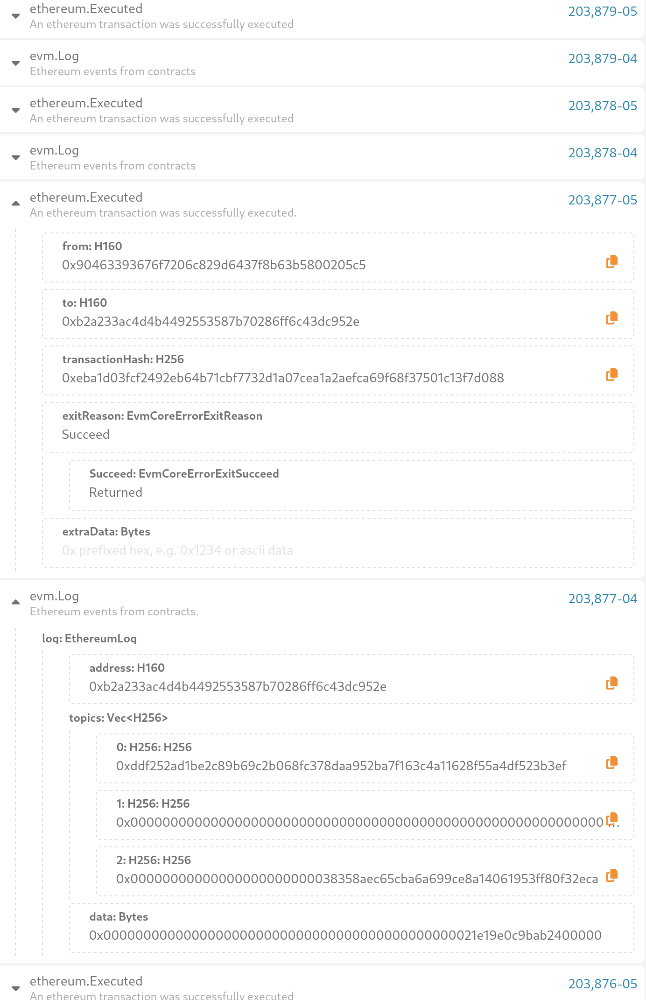

# Integration Testing

## Test suites

Currently this directory contains a smart contract test suite, written by the
SmartContract team at Gluwa. Its purpose is to verify Creditcoin 3 support for
various smart contract functionalities.

## How to execute

1. Install the dependencies

```bash
npm install
```

2. Execute the test suite

```bash
./node_modules/.bin/basicTest --rpc <creditcoin-rpc-url> --private_key <private-key-for-a-funded-account>

# Not ready, https://gluwa.slack.com/archives/C03MQ532BGA/p1698247767108099?thread_ts=1698217688.874159&cid=C03MQ532BGA
# ./node_modules/.bin/advancedTest --rpc <creditcoin-rpc-url> --private_key <private-key-for-a-funded-account>
```

**Note:** the `--rpc` argument expects http or https! It does not work with WebSockets!

For more information about development accounts and their private keys consult
<https://docs.moonbeam.network/builders/get-started/networks/moonbeam-dev/#pre-funded-development-accounts>.

**Note:** if you wish to execute against Devnet, Testnet or Mainnet make sure
to adjust the value of the `--rpc` argument and possibly the value of `--private_key`!

You can see the EVM events inside the Polkadot Portal:

